# S2Windows

S2Windows is a desktop application built with Tauri, SvelteKit, and Rust that allows you to easily connect and use
Nintendo Switch 2 controllers on your Windows PC. The app emulates your connected devices as standard XInput (Xbox 360)
or DualShock 4 (PS4) controllers, ensuring maximum compatibility with PC games.

## Features

The application is built around three main steps:

### 1. Connect Controllers

Seamlessly pair your Nintendo Switch 2 controllers to your PC via Bluetooth.
Supported devices include:

* Joy-Cons (Left and Right)
* Dual Joy-Cons (Combined as a single controller)
* Nintendo Switch Pro Controller
* Nintendo Switch Online GameCube Controller

<table>
  <tr>
    <td width="50%">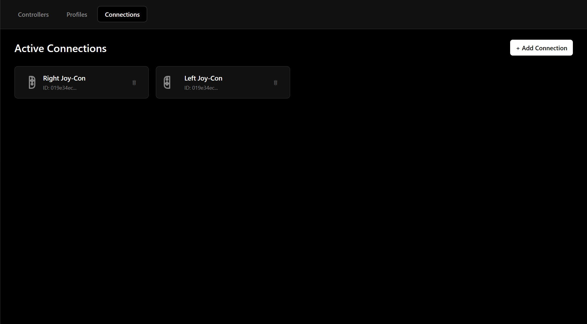</td>
    <td width="50%">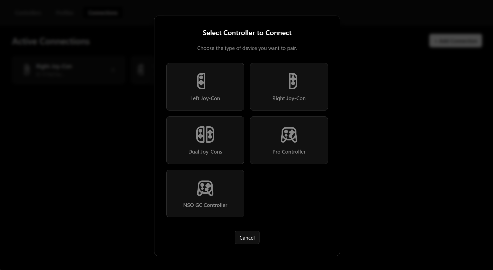</td>
  </tr>
  <tr>
    <td colspan="2" align="center">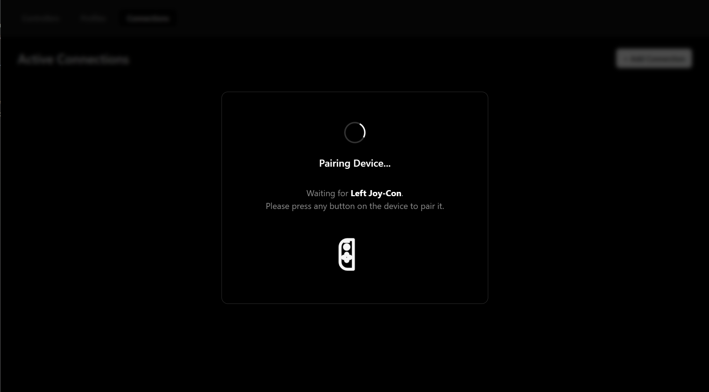</td>
  </tr>
</table>

### 2. Define Profiles

Create and customize profiles to map your controller's inputs to your desired output. You can set up exactly how your
physical controller buttons map to the emulated Xbox 360 or PS4 controller buttons.

<table>
  <tr>
    <td width="50%">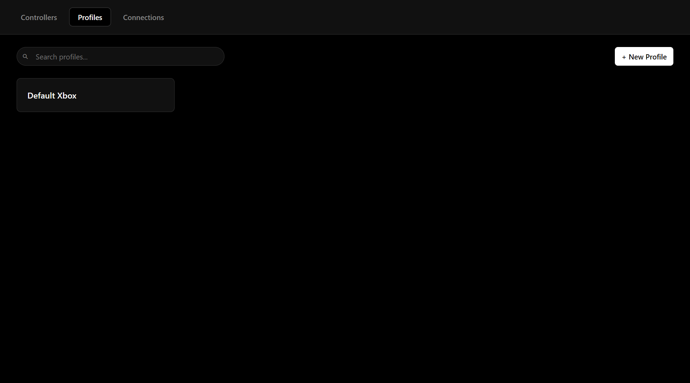</td>
    <td width="50%">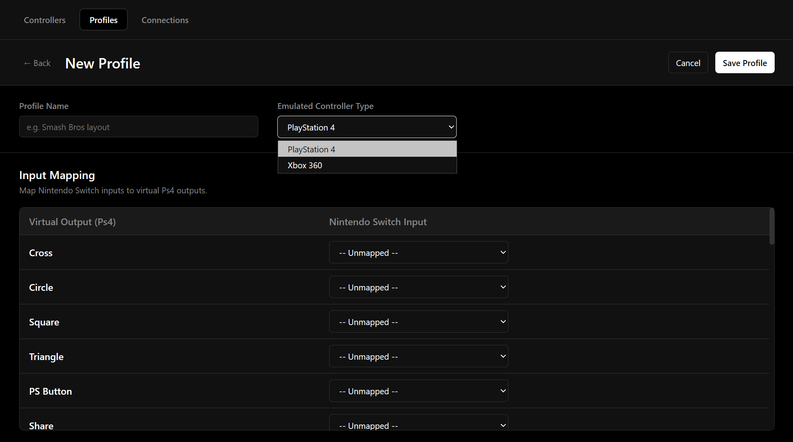</td>
  </tr>
  <tr>
    <td colspan="2" align="center">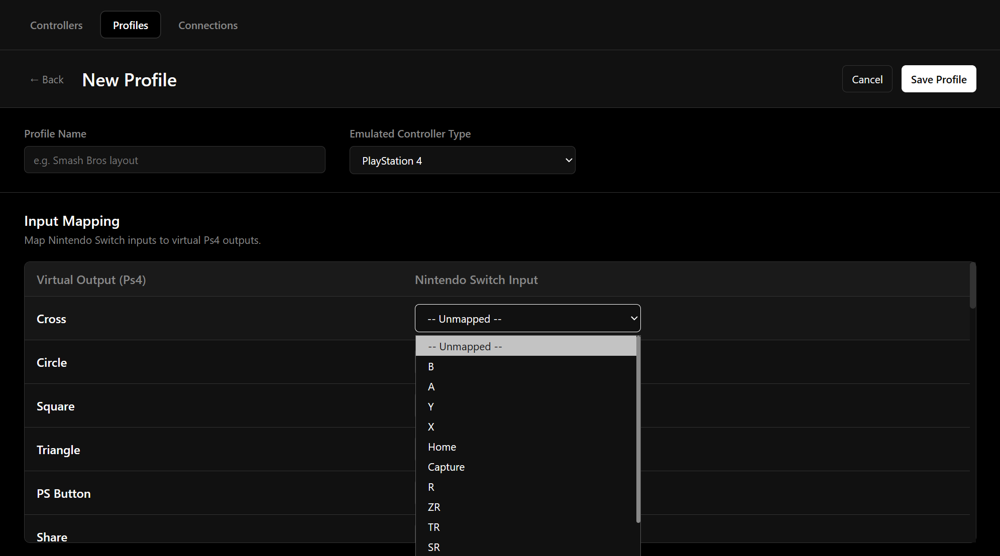</td>
  </tr>
</table>

### 3. Emulation (Controllers)

Establish associations between your connected physical controllers and your defined profiles. Once associated, you can
start the emulation process, running all defined controllers in the background to play your favorite games!

<table>
  <tr>
    <td width="50%">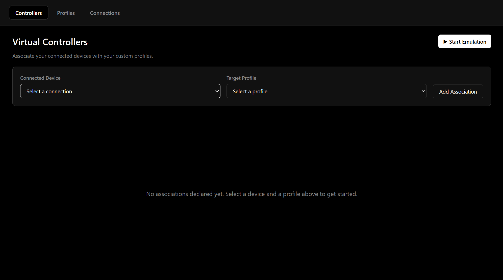</td>
    <td width="50%">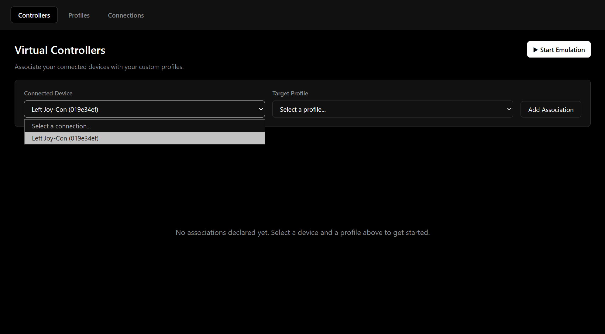</td>
  </tr>
  <tr>
    <td width="50%">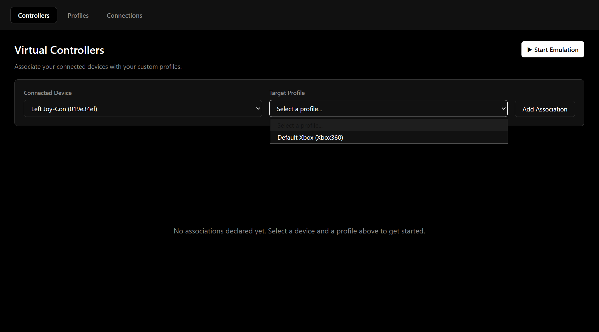</td>
    <td width="50%">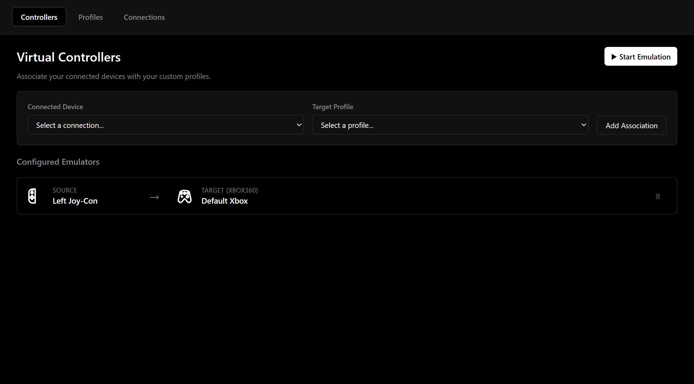</td>
  </tr>
  <tr>
    <td colspan="2" align="center">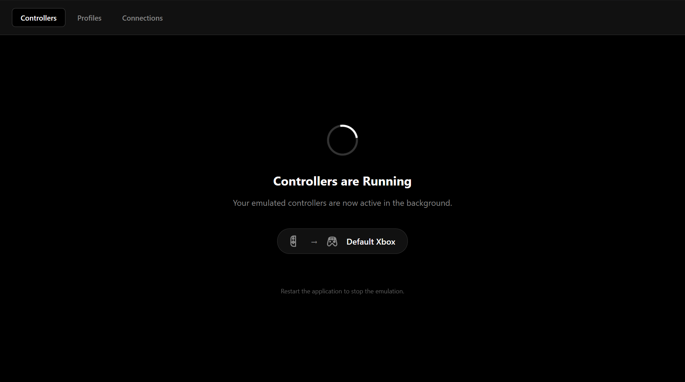</td>
  </tr>
</table>

## Dependencies

- Windows PC with Bluetooth capabilities.
- [ViGEmBus](https://github.com/nefarius/ViGEmBus) driver installed (required for emulating Xbox 360 and PS4
  controllers).
