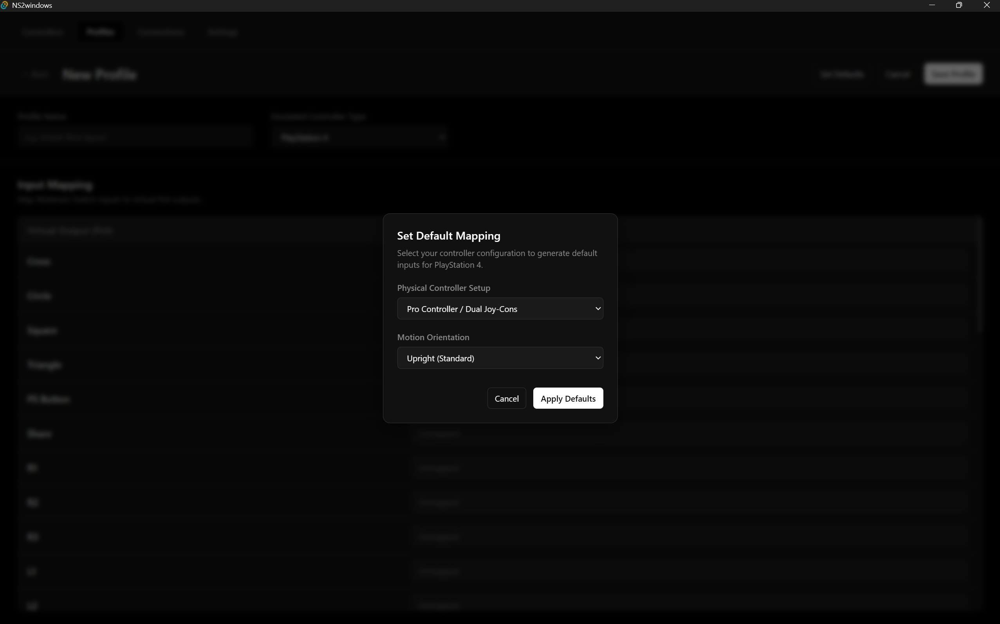
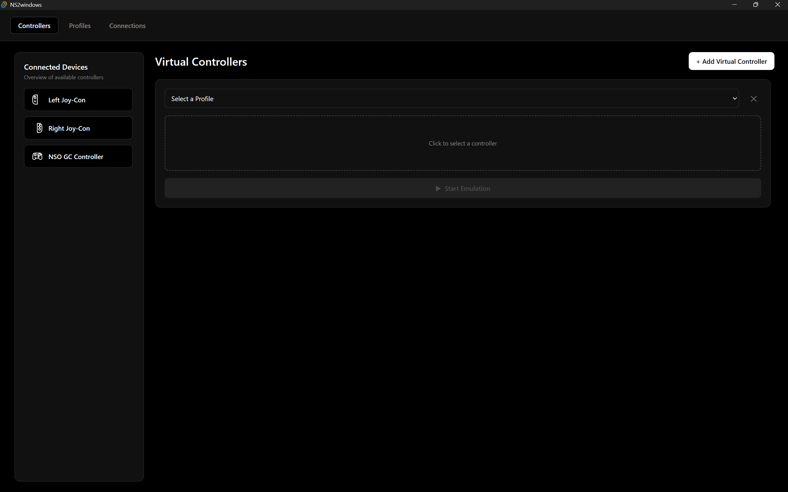

# NS2Windows

NS2Windows is a desktop application built with Tauri, SvelteKit, and Rust that allows you to easily connect and use
Nintendo Switch 2 controllers on your Windows PC. The app emulates your connected devices as standard XInput (Xbox 360)
or DualShock 4 (PS4) controllers, ensuring maximum compatibility with PC games.

## Installation

1. Download the .msi installer from the [latest release](https://github.com/valentinbersi/NS2Windows/releases/latest).
2. Once downloaded, double-click to execute it and follow the installation instructions.

If you are interested in older versions, you can check them out on
the [release page](https://github.com/valentinbersi/NS2Windows/releases).

## Features

The application is built around three main steps:

### 1. Connect Controllers

Seamlessly pair your Nintendo Switch 2 controllers to your PC via Bluetooth.
Supported devices include:

* Joy-Cons (Left and Right)
* Nintendo Switch Pro Controller
* Nintendo Switch Online GameCube Controller

<table>
  <tr>
    <td></td>
    <td></td>
  </tr>
  <tr>
    <td colspan="2" align="center"></td>
  </tr>
</table>

### 2. Define Profiles

Create and customize profiles to map your controller's inputs to your desired output. You can set up exactly how your
physical controller buttons map to the emulated Xbox 360 or PS4 controller buttons using and/or logical expressions.
The app comes with a bundled editor for easily creating this expressions.

You can also populate the inputs answering two questions about the targeted device and how you plan to use it.

<table>
  <tr>
    <td></td>
    <td></td>
  </tr>
  <tr>
    <td></td>
    <td></td>
  </tr>
</table>

### 3. Emulation (Controllers)

Establish associations between your connected physical controllers and your defined profiles. Once associated, you can
start the emulation process, running all defined controllers in the background to play your favorite games!

<table>
  <tr>
    <td width="50%"></td>
    <td width="50%"></td>
  </tr>
  <tr>
    <td width="50%"></td>
    <td width="50%"></td>
  </tr>
  <tr>
    <td width="50%"></td>
    <td width="50%"></td>
  </tr>
</table>

## Dependencies

- Windows PC with Bluetooth capabilities.
- [ViGEmBus](https://github.com/nefarius/ViGEmBus) driver installed (required for emulating Xbox 360 and PS4
  controllers).
- [Microsoft Visual C++ Redistributable 2015–2022 (x64)](https://learn.microsoft.com/en-us/cpp/windows/latest-supported-vc-redist?view=msvc-170)
  installed
  (required for btle connections)

## Acknowledgments

- [ndeadly/switch2_controller_research](https://github.com/ndeadly/switch2_controller_research): this repository was a
  general guide on how to communicate with switch 2 controllers and how they report inputs.

- [TheFrano/joycon2cpp](https://github.com/TheFrano/joycon2cpp): their project was super helpful to see a real-world
  example on how to interact with Switch 2 controllers.

If you want to contribute to this project, I recommend both checking these repositories.
