# NS2Windows

NS2Windows is a desktop application built with Tauri, SvelteKit, and Rust that allows you to easily connect and use
Nintendo Switch 2 controllers on your Windows PC. The app emulates your connected devices as standard XInput (Xbox 360)
or DualShock 4 (PS4) controllers, ensuring maximum compatibility with PC games.

## Installation

1. Download the .msi installer from the [latest release](https://github.com/valentinbersi/NS2Windows/releases/latest).
2. Once downloaded, double-click to execute it and follow the installation instructions.

If you are interested in older versions, you can check them out on
the [release page](https://github.com/valentinbersi/NS2Windows/releases).

## Features

The application is built around three main steps:

### 1. Connect Controllers

Seamlessly pair your Nintendo Switch 2 controllers to your PC via Bluetooth.
Supported devices include:

* Joy-Cons (Left and Right)
* Nintendo Switch Pro Controller
* Nintendo Switch Online GameCube Controller

<table>
  <tr>
    <td>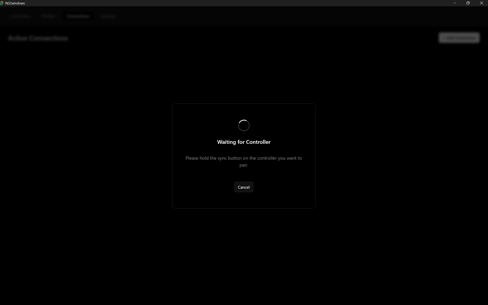</td>
    <td>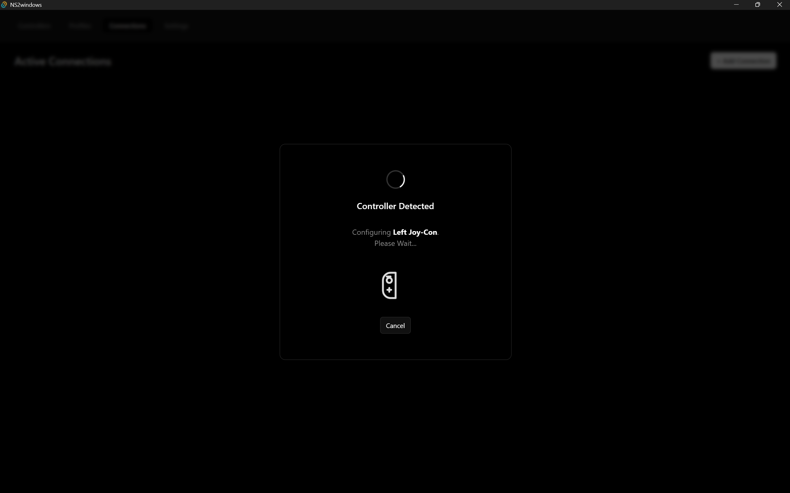</td>
  </tr>
  <tr>
    <td colspan="2" align="center">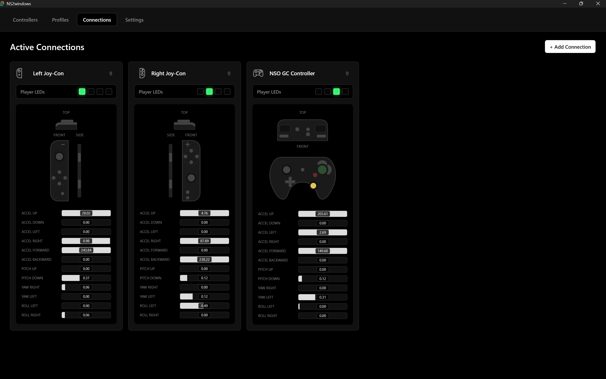</td>
  </tr>
</table>

### 2. Define Profiles

Create and customize profiles to map your controller's inputs to your desired output. You can set up exactly how your
physical controller buttons map to the emulated Xbox 360 or PS4 controller buttons using and/or logical expressions.
The app comes with a bundled editor for easily creating this expressions.

You can also populate the inputs answering two questions about the targeted device and how you plan to use it.

<table>
  <tr>
    <td>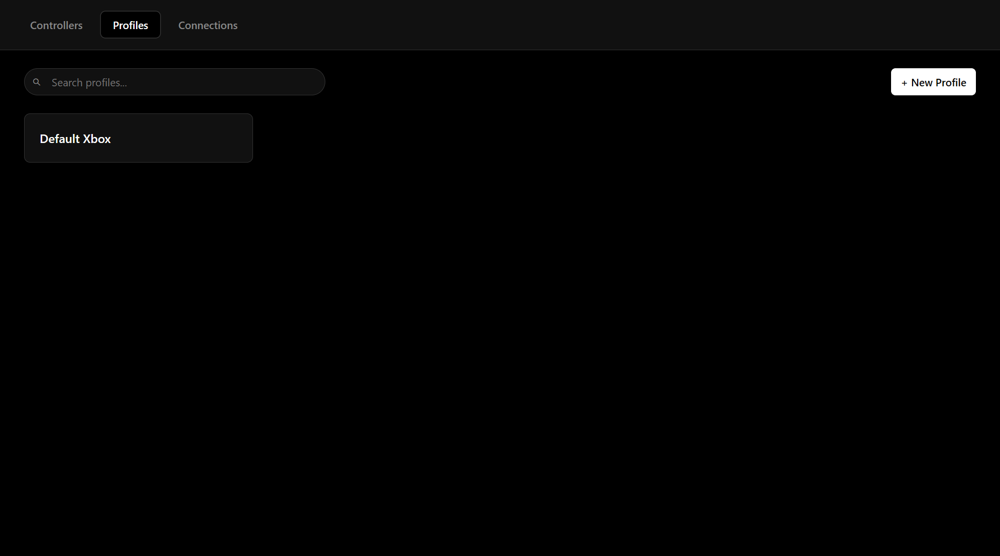</td>
    <td>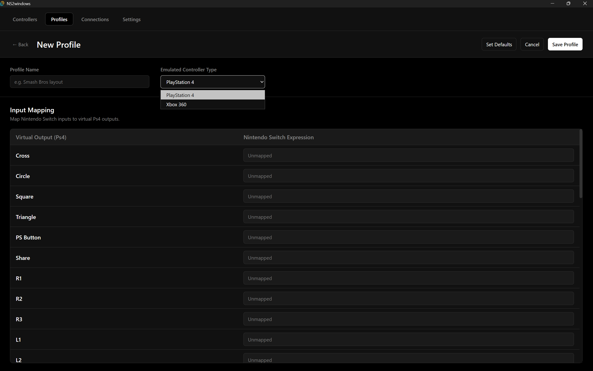</td>
  </tr>
  <tr>
    <td>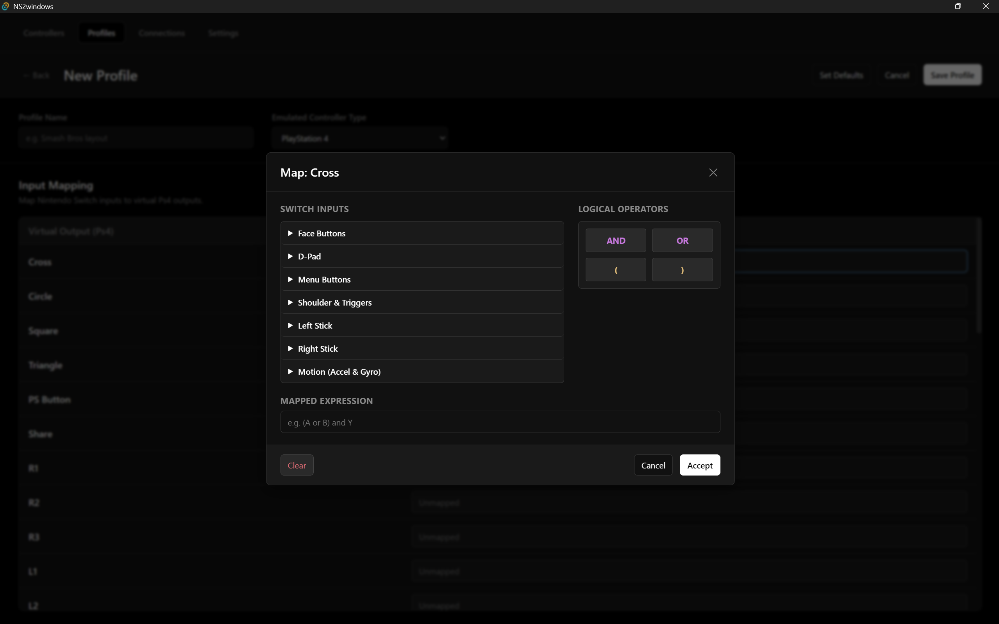</td>
    <td>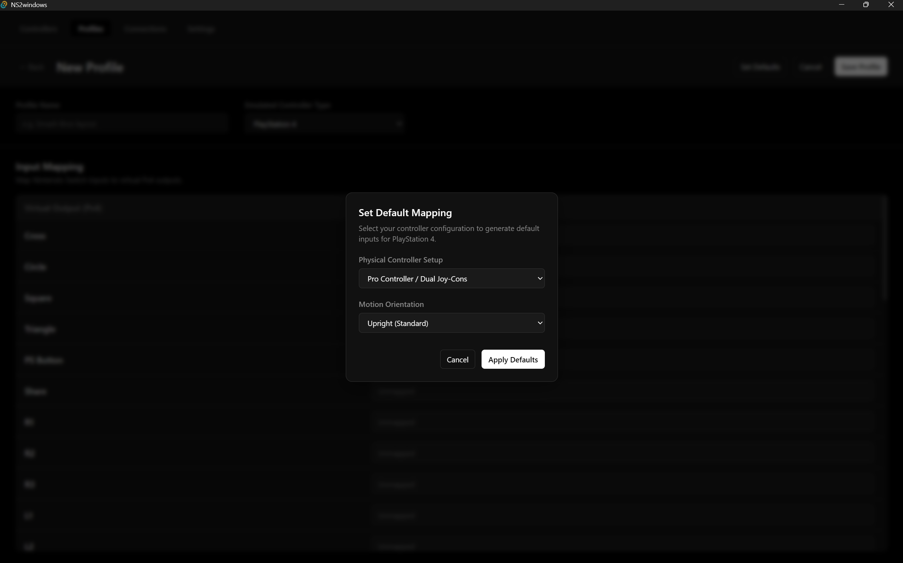</td>
  </tr>
</table>

### 3. Emulation (Controllers)

Establish associations between your connected physical controllers and your defined profiles. Once associated, you can
start the emulation process, running all defined controllers in the background to play your favorite games!

<table>
  <tr>
    <td width="50%">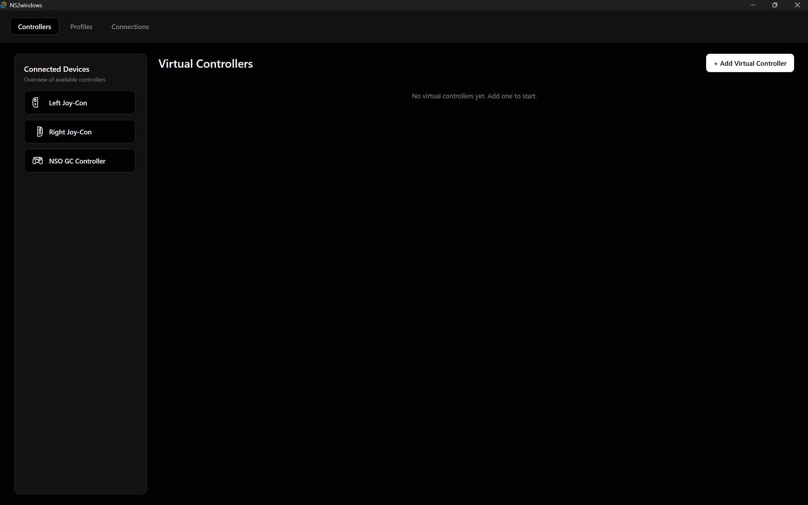</td>
    <td width="50%">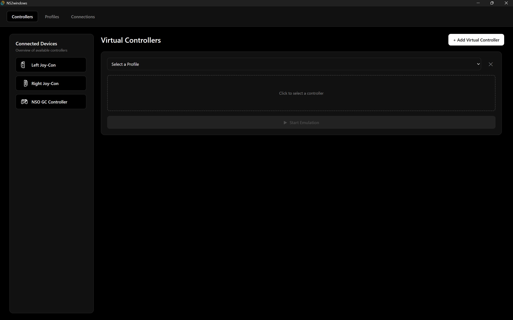</td>
  </tr>
  <tr>
    <td width="50%">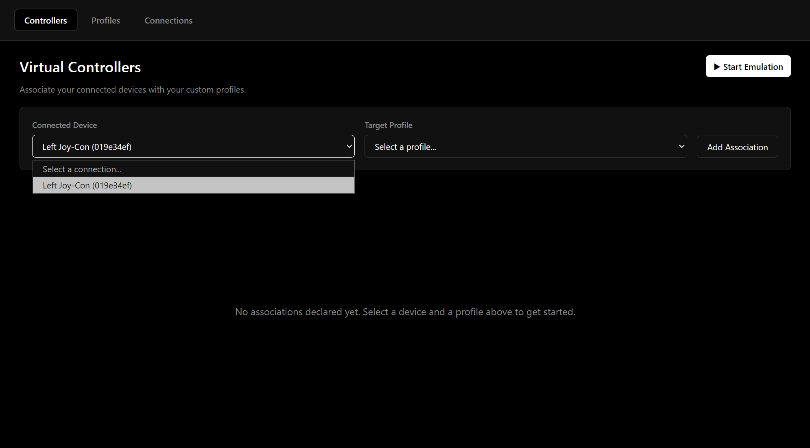</td>
    <td width="50%">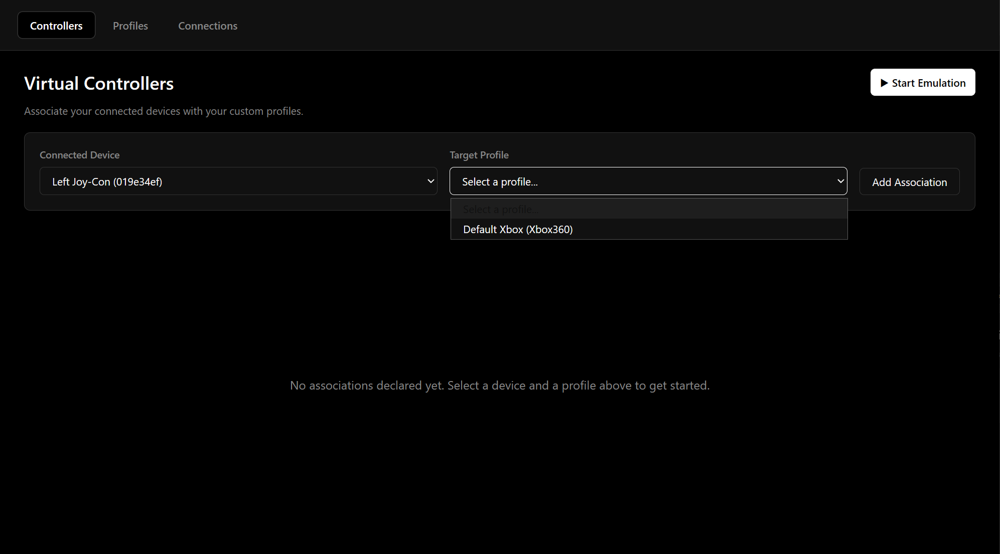</td>
  </tr>
  <tr>
    <td width="50%">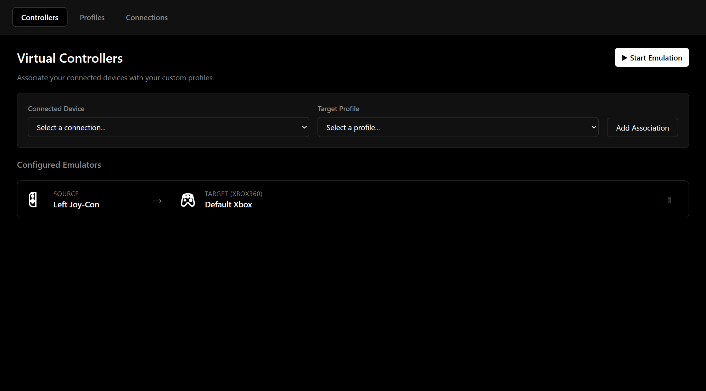</td>
    <td width="50%">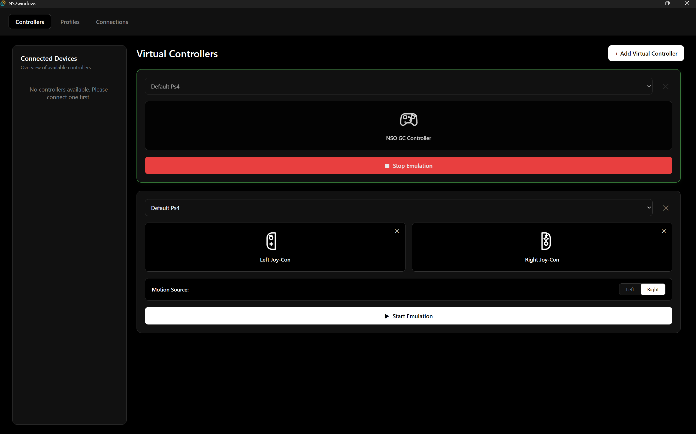</td>
  </tr>
</table>

## Motion Output

Before starting a virtual controller, choose **Motion Output: ViGEm** or **CemuHook** in the Controllers tab.
PS4 profiles default to ViGEm. Xbox 360 profiles always use CemuHook for motion because Xbox 360 reports have no motion
fields. Buttons, sticks, and supported rumble still use ViGEm in either mode. Paired Joy-Cons use the existing Left/Right
Motion Source selection; their motion occupies one CemuHook slot.

CemuHook sends the profile's acceleration and gyro mappings through a motion-only
[DSU protocol v1001 server](https://v1993.github.io/cemuhook-protocol/). In CemuHook mode, PS4 ViGEm motion fields are zero.
The server starts with the first CemuHook controller and stops with the last. It supports four simultaneous controllers,
assigning the lowest available slot from 0 to 3. Stop a controller to free its slot. Discover the sources in your emulator
and select the matching slot as its motion source; use ViGEm/XInput/DS4 for its regular inputs.

Configure **CemuHook Bind Address** and **CemuHook Port** in Settings. Defaults are `127.0.0.1` and `26760`; enter the same
endpoint in the emulator's CemuHook/DSU client. For a LAN client, bind to this PC's LAN IP (or `0.0.0.0`/`::` for all
interfaces), then enter this PC's reachable IP in the client. IPv4 and IPv6 literals are supported; hostnames are not.
Allow inbound UDP on the chosen port in Windows Firewall if needed for LAN access. Stop every CemuHook controller before
changing the endpoint. Other Settings changes can still be applied while controllers run. If startup reports an occupied
port, stop the other motion server or choose another port in both applications.

Motion mappings can be edited for both profile types. Apply Defaults offers upright/front-facing motion orientation for
Xbox profiles as well as PS4 profiles. Existing Xbox profiles receive missing motion mappings once on first launch after
this feature is installed, using upright identity mappings; existing mappings, profile names, and IDs are preserved.
Choose Apply Defaults for the appropriate setup/orientation when using a sideways Joy-Con. Later mapping removals remain
removed. Motion-output selections last for the current app session; server settings persist across launches.

Developer checks: `npm run check`, `npm run build`, `node --test tests/motion.test.mjs`, and
`cargo test --locked` / `cargo check --locked` from `src-tauri`. The UDP tests use an actual local socket and DSU requests;
physical-controller orientation and compatibility with a real emulator also require hardware validation.

## Dependencies

- Windows PC with Bluetooth capabilities.
- [ViGEmBus](https://github.com/nefarius/ViGEmBus) driver installed (required for emulating Xbox 360 and PS4
  controllers).
- [Microsoft Visual C++ Redistributable 2015–2022 (x64)](https://learn.microsoft.com/en-us/cpp/windows/latest-supported-vc-redist?view=msvc-170)
  installed
  (required for btle connections)

## Acknowledgments

- [ndeadly/switch2_controller_research](https://github.com/ndeadly/switch2_controller_research): this repository was a
  general guide on how to communicate with switch 2 controllers and how they report inputs.

- [TheFrano/joycon2cpp](https://github.com/TheFrano/joycon2cpp): their project was super helpful to see a real-world
  example on how to interact with Switch 2 controllers.

If you want to contribute to this project, I recommend both checking these repositories.
