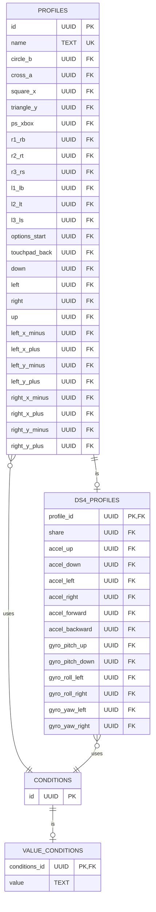

```mermaid
erDiagram
    CONDITIONS {
        id UUID PK
    }

    VALUE_CONDITIONS {
        conditions_id UUID PK, FK
        value TEXT
    }

    PROFILES {
        id UUID PK
        name TEXT UK
        circle_b UUID FK
        cross_a UUID FK
        square_x UUID FK
        triangle_y UUID FK
        ps_xbox UUID FK
        r1_rb UUID FK
        r2_rt UUID FK
        r3_rs UUID FK
        l1_lb UUID FK
        l2_lt UUID FK
        l3_ls UUID FK
        options_start UUID FK
        touchpad_back UUID FK
        down UUID FK
        left UUID FK
        right UUID FK
        up UUID FK
        left_x_minus UUID FK
        left_x_plus UUID FK
        left_y_minus UUID FK
        left_y_plus UUID FK
        right_x_minus UUID FK
        right_x_plus UUID FK
        right_y_minus UUID FK
        right_y_plus UUID FK
    }

    DS4_PROFILES {
        profile_id UUID PK, FK
        share UUID FK
        accel_up UUID FK
        accel_down UUID FK
        accel_left UUID FK
        accel_right UUID FK
        accel_forward UUID FK
        accel_backward UUID FK
        gyro_pitch_up UUID FK
        gyro_pitch_down UUID FK
        gyro_roll_left UUID FK
        gyro_roll_right UUID FK
        gyro_yaw_left UUID FK
        gyro_yaw_right UUID FK
    }

    PROFILES ||--o| DS4_PROFILES: "is"
    PROFILES }o--|| CONDITIONS: "uses"
    DS4_PROFILES }o--|| CONDITIONS: "uses"
    CONDITIONS ||--o| VALUE_CONDITIONS: "is"
```