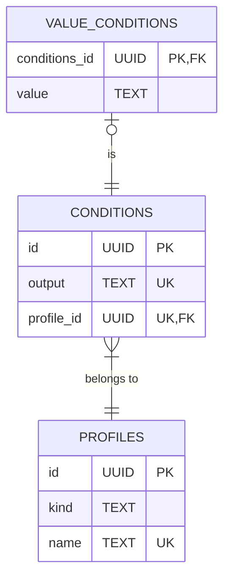

```mermaid
erDiagram
    CONDITIONS {
        id UUID PK
        output TEXT UK
        profile_id UUID UK, FK
    }

    VALUE_CONDITIONS {
        conditions_id UUID PK, FK
        value TEXT
    }

    PROFILES {
        id UUID PK
        kind TEXT
        name TEXT UK
    }

    CONDITIONS }|--|| PROFILES: "belongs to"
    VALUE_CONDITIONS |o--|| CONDITIONS: "is"
```